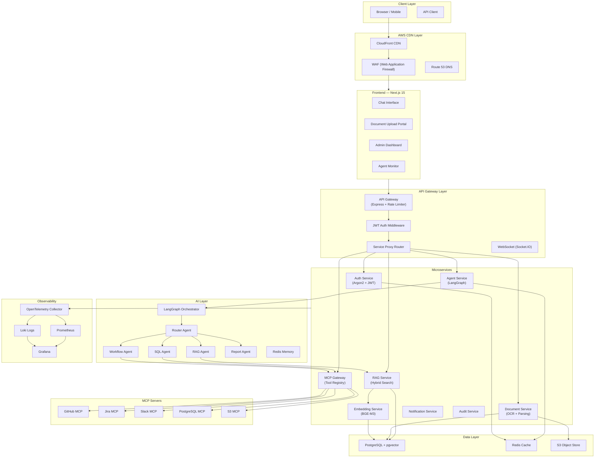
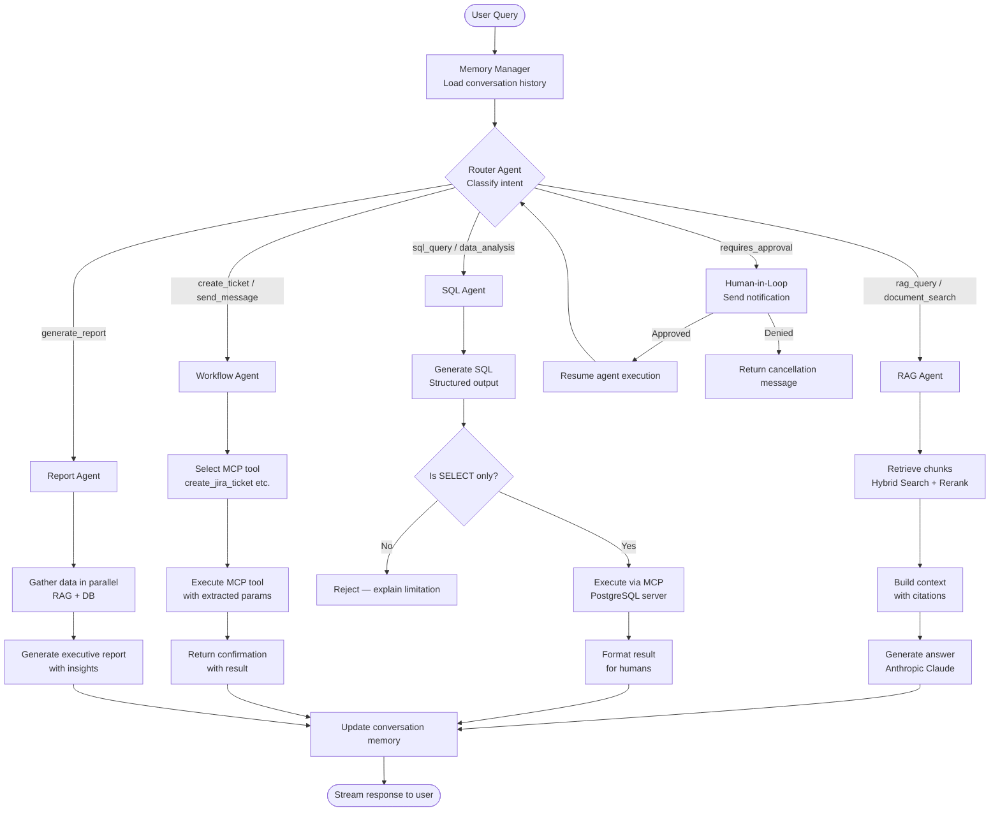
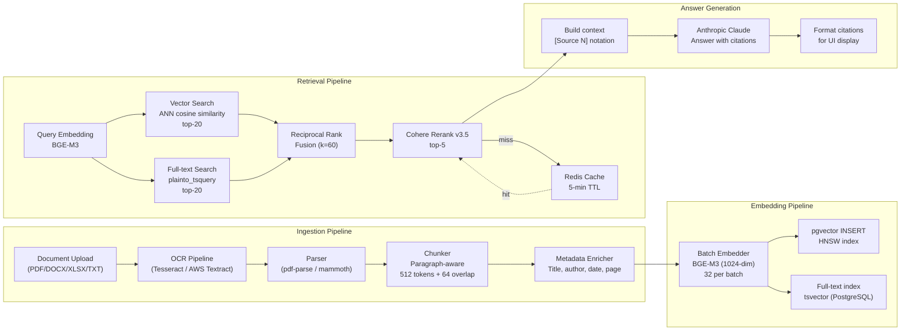
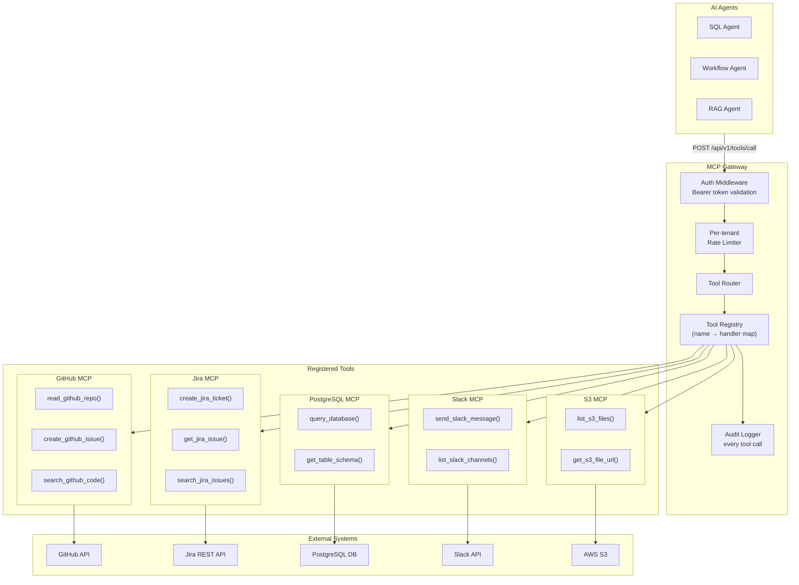
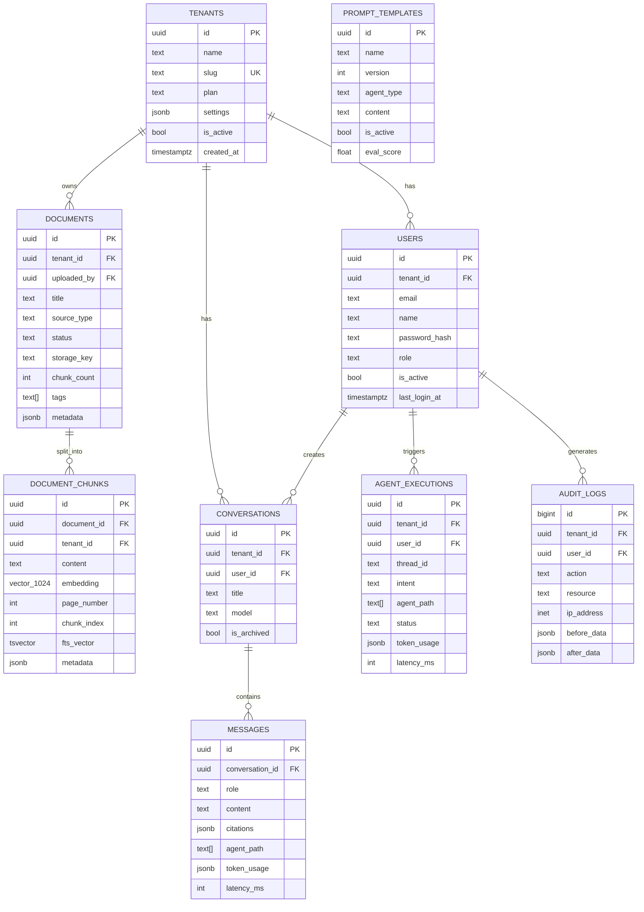
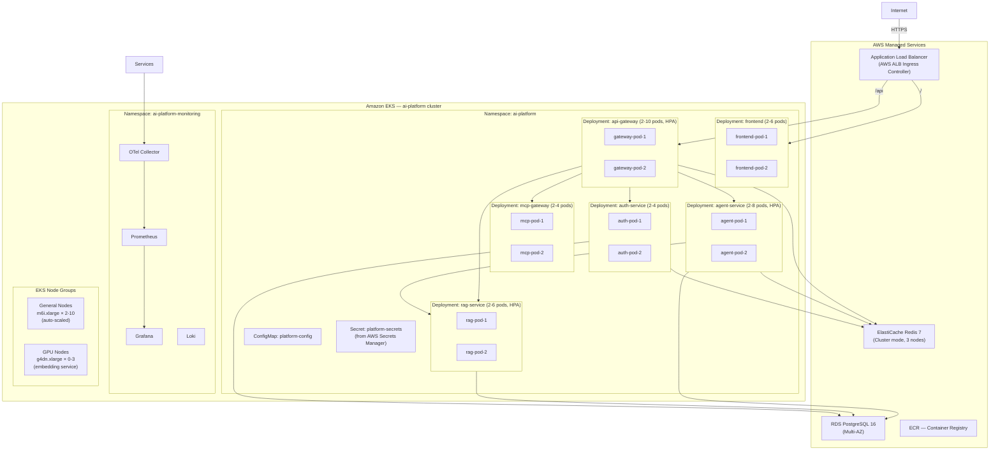
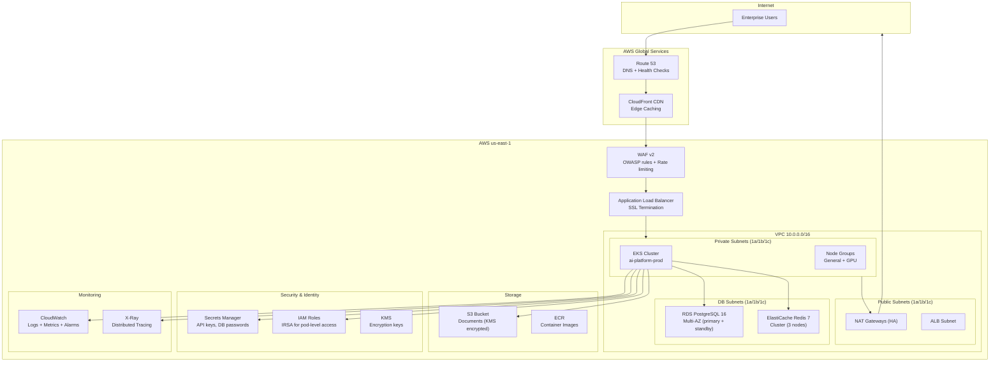
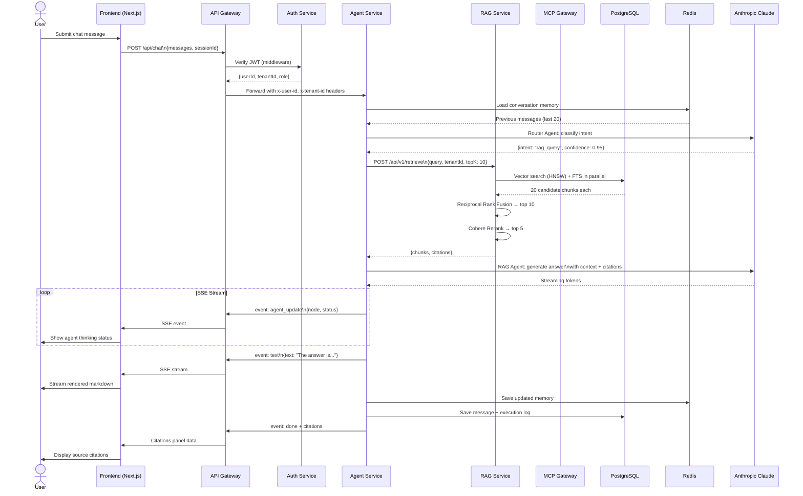
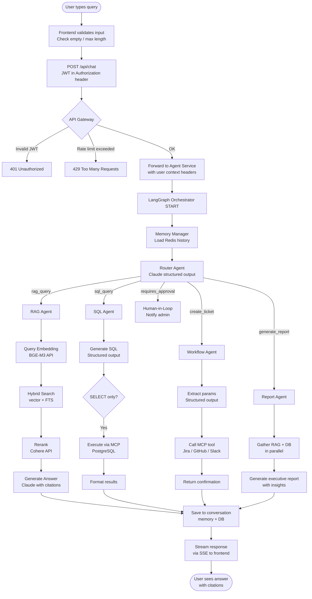

# Enterprise AI Knowledge Assistant Platform — Architecture

## Table of Contents
1. [High-Level System Architecture](#1-high-level-system-architecture)
2. [Agentic AI Workflow](#2-agentic-ai-workflow)
3. [RAG Pipeline](#3-rag-pipeline)
4. [MCP Architecture](#4-mcp-architecture)
5. [Database Architecture](#5-database-architecture)
6. [Kubernetes Deployment](#6-kubernetes-deployment)
7. [CI/CD Pipeline](#7-cicd-pipeline)
8. [AWS Infrastructure](#8-aws-infrastructure)
9. [Request Flow](#9-request-flow)
10. [User Query Execution Flow](#10-user-query-execution-flow)
11. [Service Responsibilities](#11-service-responsibilities)
12. [Security Architecture](#12-security-architecture)
13. [MLOps / LLMOps](#13-mlops--llmops)
14. [Development Roadmap](#14-development-roadmap)
15. [Production Considerations](#15-production-considerations)

---

## 1. High-Level System Architecture



---

## 2. Agentic AI Workflow



---

## 3. RAG Pipeline



---

## 4. MCP Architecture



---

## 5. Database Architecture



---

## 6. Kubernetes Deployment



---

## 7. CI/CD Pipeline

```mermaid
flowchart LR
    subgraph Dev["Developer"]
        PR["Pull Request"]
        Push["git push main"]
    end

    subgraph CI["CI Pipeline (GitHub Actions)"]
        Lint["Lint &\nType Check"]
        UnitTest["Unit Tests\n+ Coverage"]
        IntTest["Integration Tests\n(real PG + Redis)"]
        SecScan["Security Scan\n(Trivy + SonarQube)"]
        DockerBuild["Docker Build\n(multi-stage)"]
        ImageScan["Image Scan\n(Trivy)"]
        PushECR["Push to ECR\n(SHA + latest tag)"]
    end

    subgraph CD_Dev["CD — Dev"]
        DevDeploy["kubectl apply\n(dev namespace)"]
        DevSmoke["Smoke Tests"]
    end

    subgraph CD_Staging["CD — Staging"]
        StagingDeploy["kubectl set image\n(staging namespace)"]
        E2E["E2E Tests\n(Playwright)"]
        LoadTest["Load Test\n(k6)"]
    end

    subgraph CD_Prod["CD — Production"]
        ProdApproval["Manual Approval\n(GitHub Environment)"]
        BlueGreen["Blue/Green Deploy\nkubectl rollout"]
        Rollout["Wait for rollout\n--timeout=300s"]
        SmokeTest["Smoke Test\n/health endpoint"]
        Rollback["Rollback\nif smoke fails"]
        SlackNotify["Slack Notification\n✅ or 🚨"]
    end

    PR --> Lint --> UnitTest & IntTest
    UnitTest & IntTest --> SecScan
    SecScan --> DockerBuild --> ImageScan --> PushECR
    Push --> CI
    PushECR --> DevDeploy --> DevSmoke
    DevSmoke -->|pass| StagingDeploy --> E2E --> LoadTest
    LoadTest -->|pass| ProdApproval --> BlueGreen --> Rollout
    Rollout --> SmokeTest
    SmokeTest -->|pass| SlackNotify
    SmokeTest -->|fail| Rollback --> SlackNotify
```



---

## 8. AWS Infrastructure



---

## 9. Request Flow



---

## 10. User Query Execution Flow



---

## 11. Service Responsibilities

| Service | Port | Responsibility |
|---------|------|----------------|
| **api-gateway** | 3000 | Single entry point: JWT auth, rate limiting, CORS, service proxy, WebSocket relay |
| **auth-service** | 3001 | User registration/login, JWT issue/refresh/revoke, RBAC, password hashing (Argon2) |
| **agent-service** | 3002 | LangGraph orchestration, intent routing, multi-agent execution, streaming, memory |
| **rag-service** | 3003 | Document retrieval: hybrid vector+FTS search, Cohere reranking, citation generation |
| **document-service** | 3004 | File upload, PDF/DOCX/XLSX parsing, OCR, chunking trigger, storage to S3 |
| **embedding-service** | 3005 | BGE-M3 embedding generation, batch processing, embedding versioning |
| **mcp-gateway** | 3006 | MCP tool registry, external API calls (GitHub/Jira/Slack/S3/PG), audit logging |
| **notification-service** | 3007 | Email/Slack notifications, human-in-loop approval requests, async event processing |
| **audit-service** | 3008 | Immutable audit log writes, compliance reporting, user action tracking |

---

## 12. Security Architecture

### Authentication & Authorization
- **JWT** with short expiry (24h access, 7d refresh) — refresh tokens stored hashed in Redis
- **RBAC** — `admin > manager > user > readonly` enforced at API Gateway + service level
- **Multi-tenant isolation** — all DB queries filtered by `tenant_id` from JWT claim
- **Argon2id** password hashing (memory-hard, resistant to GPU attacks)

### Network Security
- **WAF** (AWS WAFv2): OWASP CRS + custom rate-limit rules (2000 req/5min per IP)
- **Network Policies** (Kubernetes): default-deny-all, explicit allow between services only
- **TLS everywhere**: CloudFront → ALB (HTTPS), ALB → services (HTTPS), RDS/Redis (TLS)
- **CORS**: restrictive origin allowlist, credentials=true only for trusted origins

### Secrets Management
- All secrets in **AWS Secrets Manager**, injected as K8s Secrets via External Secrets Operator
- **IRSA** (IAM Roles for Service Accounts) — pod-level AWS permissions, no long-lived credentials
- No secrets in Docker images, git history, or ConfigMaps

### AI-Specific Security
- **Prompt injection protection**: system prompts non-overridable, user input sandboxed
- **SQL injection prevention**: MCP PostgreSQL tool enforces SELECT-only via regex + Zod validation
- **RAG security**: chunks filtered by `tenant_id` — no cross-tenant data leakage
- **Output validation**: Zod schemas on all structured LLM outputs (RouterAgent, SQLAgent, WorkflowAgent)
- **Token limits**: max output tokens enforced per agent to prevent runaway cost

### Compliance
- **Audit logs**: every user action, every MCP tool call, every agent execution logged immutably
- **Data at rest**: RDS encrypted (AES-256 via KMS), S3 SSE-KMS, Redis encryption-at-rest
- **Data in transit**: TLS 1.2+ enforced everywhere

---

## 13. MLOps / LLMOps

### Prompt Versioning
- Prompts stored in `prompt_templates` table with semantic versioning
- A/B testing via feature flags per tenant
- Rollback: flip `is_active` to previous version row

### Evaluation Pipeline
```
User queries → Agent execution → Store (input, output, token_usage, latency)
                                    ↓
                             Offline evaluation
                           ├── RAGAS (faithfulness, answer_relevancy, context_precision)
                           ├── Custom scorers (citation accuracy, SQL correctness)
                           └── Human feedback (thumbs up/down in UI)
```

### Cost Monitoring
- Token usage tracked per message in `messages.token_usage`
- Daily aggregation in `analytics_summary.estimated_cost`
- Grafana dashboard: cost per tenant, per model, per agent type
- Alerts: CloudWatch alarm if daily cost > threshold

### Embedding Versioning
- Embedding dimension stored in `document_chunks` metadata
- On model upgrade: re-embed all documents for tenant (background job)
- Dual-index during migration: old + new embeddings served simultaneously

---

## 14. Development Roadmap

### Phase 1 — Local Development (Week 1–2)
**Learning Objectives**: Monorepo setup, TypeScript, pnpm workspaces, Turborepo  
**Deliverables**: Working frontend + API Gateway + Auth service locally  
**Skills**: Next.js 15, Express, JWT, Docker Compose

### Phase 2 — RAG Implementation (Week 3–4)
**Learning Objectives**: Vector databases, embeddings, chunking strategies  
**Deliverables**: Document upload → embedding → retrieval pipeline  
**Skills**: pgvector, BGE-M3, Cohere Rerank, PostgreSQL full-text search

### Phase 3 — Agentic AI (Week 5–6)
**Learning Objectives**: LangGraph, multi-agent systems, tool calling  
**Deliverables**: Router + RAG + SQL + Workflow agents with streaming  
**Skills**: LangGraph, LangChain, Anthropic SDK, SSE streaming

### Phase 4 — MCP Integration (Week 7–8)
**Learning Objectives**: Model Context Protocol, external API integration  
**Deliverables**: MCP Gateway with GitHub, Jira, Slack, S3 tools  
**Skills**: MCP SDK, Octokit, Jira REST API, Slack API, AWS SDK

### Phase 5 — Dockerization (Week 9)
**Learning Objectives**: Multi-stage builds, container security, image optimization  
**Deliverables**: Production-ready Dockerfiles for all services  
**Skills**: Docker BuildKit, non-root containers, layer caching

### Phase 6 — Kubernetes (Week 10–11)
**Learning Objectives**: K8s primitives, HPA, PDB, Network Policies  
**Deliverables**: Full K8s manifests with Kustomize overlays  
**Skills**: kubectl, Kustomize, Helm basics, resource limits, health probes

### Phase 7 — CI/CD (Week 12)
**Learning Objectives**: GitHub Actions, ECR, automated testing  
**Deliverables**: Full CI pipeline + blue/green CD to EKS  
**Skills**: GitHub Actions, Docker BuildKit cache, Trivy, SonarQube

### Phase 8 — AWS Deployment (Week 13–14)
**Learning Objectives**: EKS, RDS, ElastiCache, WAF, Terraform  
**Deliverables**: Production AWS infrastructure via Terraform  
**Skills**: Terraform, EKS, RDS, Route53, CloudFront, IAM/IRSA

### Phase 9 — Production Hardening (Week 15)
**Learning Objectives**: Security best practices, rate limiting, secrets management  
**Deliverables**: External Secrets Operator, Network Policies, WAF rules  
**Skills**: AWS Secrets Manager, cert-manager, Istio basics

### Phase 10 — Monitoring & Optimization (Week 16)
**Learning Objectives**: Observability, alerting, cost optimization  
**Deliverables**: Grafana dashboards, Prometheus alerts, LLM cost tracking  
**Skills**: OpenTelemetry, Prometheus, Grafana, Loki, RAGAS evaluation

---

## 15. Production Considerations

### Scalability
- All services stateless → horizontal scaling via HPA (CPU + memory triggers)
- Agent service scales independently from RAG service
- pgvector HNSW index supports millions of vectors with sub-100ms ANN search
- Redis Cluster for session memory and query caching

### High Availability
- EKS node groups across 3 AZs
- RDS Multi-AZ with automatic failover (~30s)
- ElastiCache Cluster mode with 3 primary nodes
- PodDisruptionBudget: `minAvailable: 1` for all critical services

### Fault Tolerance
- Circuit breakers at API Gateway level (timeout + retry with backoff)
- Graceful degradation: RAG falls back to keyword-only if vector service unavailable
- Agent timeout: 60s hard limit with meaningful error message

### Disaster Recovery
- RDS automated backups (30-day retention) + point-in-time recovery
- S3 versioning enabled for document recovery
- Terraform state in S3 with DynamoDB lock for infra recovery
- RPO: 1 hour, RTO: 30 minutes

### Cost Optimization
- Spot instances for non-critical agent service workers (60-70% savings)
- GPU nodes scale to 0 when no embedding jobs (Cluster Autoscaler)
- CloudFront caching for static Next.js assets
- LLM cost: prefer Claude Haiku for routing, Claude Sonnet for complex tasks

### Multi-Tenancy
- Row-level tenant isolation via `tenant_id` FK + enforced DB filters
- Per-tenant rate limits in Redis
- Tenant-scoped pgvector search (no cross-tenant data)
- Tenant-specific prompt templates and model configuration

### Data Governance
- PII detection before embedding (presidio or AWS Comprehend)
- Document retention policies per tenant (TTL on S3 objects)
- GDPR: data deletion cascade (user → conversations → messages → chunks)
- SOC2 audit trail via immutable `audit_logs` table
